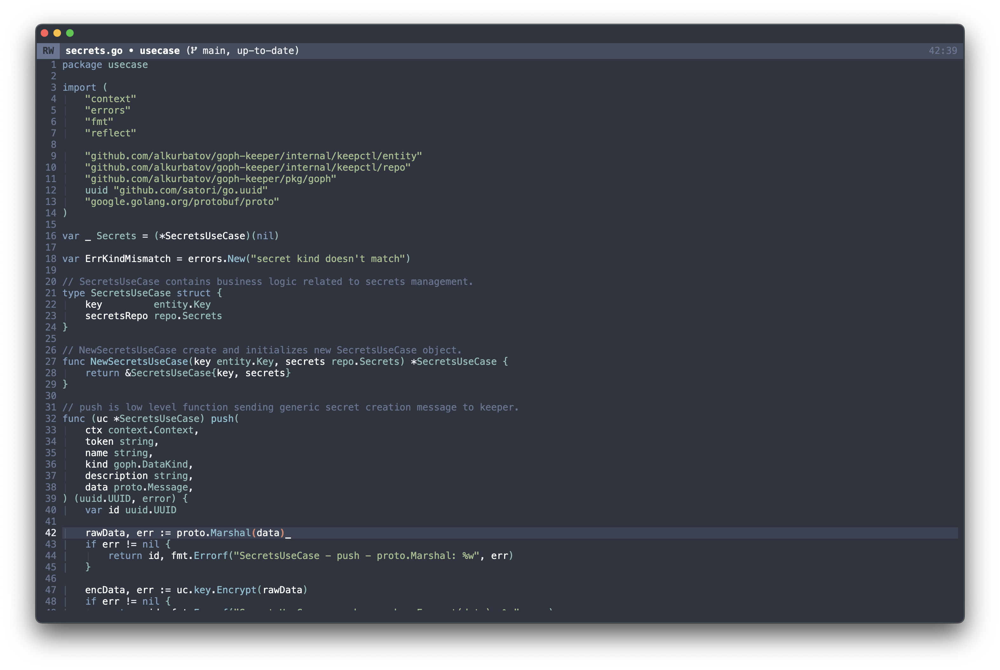

# GNU Emacs / N Λ N O (developers edition)

**GNU Emacs / N Λ N O (developers edition)** is a set of configuration files
for GNU Emacs based on [nano-emacs](https://github.com/rougier/nano-emacs)
such as to provide a nice and consistent look and feel for developers.
The dark theme is based on [Nord colors](https://www.nordtheme.com/).

The philosophy of `nano-emacs` is to stick as much as possible to
vanilla Emacs without introducing too much dependencies (or none if
possible) and to keep it modular enough. The idea is for users to copy
the part they are interested in such as to include them in their own
configuration.



## Supported programming languages and formats

- `Bash`
- `C++`
- `Elisp`
- `Golang`
- `JSON`
- `Jenkinsfile`
- `LaTeX`
- `Lua`
- `Makefile`
- `Python`
- `Raku`
- `TOML`
- `YAML`

## Limitations

- Only dark theme is supported.
- The configuration is tested on `Mac OS` and `Linux`.

## Mandatory requirements

- [GNU Emacs](https://www.gnu.org/software/emacs/) >= 30 with enabled tree-sitter.
  In case of `Mac OS`, [emacs-plus](https://github.com/d12frosted/homebrew-emacs-plus)
  is strongly recommended, e.g.:

  ```bash
  brew tap d12frosted/emacs-plus
  brew install emacs-plus@30 \
    --with-imagemagick \
    --with-savchenkovaleriy-big-sur-icon \
    --with-xwidgets
  ```

- Additional fonts

  ```bash
  brew install homebrew/cask/font-jetbrains-mono
  ```

- `coreutls` (`Mac OS` only) for better listing in `Dired`

  ```bash
  brew install coreutls
  ```

- The `fd` utility (to search files with `consult`):

  ```bash
  brew install fd
  ```

- The `vterm` library and compilation tools to build `vterm` terminal module:

  ```bash
  brew install cmake libvterm
  ```

  See also [zsh integration][zsh-integration].

- The `enchant` library to check spelling with
  [Jinx](https://github.com/minad/jinx):

  On `Mac OS`:

  ```bash
  brew install enchant pkg-config
  ```

  On Linux:

  ```bash
  apt-get install libenchant-2-dev pkgconf
  ```

### Optional requirements

- [Bash Language Server](https://github.com/bash-lsp/bash-language-server) for
  `LSP` in `Bash`.
- [Clangd](https://clangd.llvm.org/) for `LSP` in `C++`.
- [Claude code CLI][claude-code] for AI integration.
- [Golangci-lint](https://golangci-lint.run/) for linting in `Golang`.
- [Gopls and other handy Golang binaries](./scripts/up-go-tools).
- [Hunspell](https://github.com/hunspell/hunspell) for spellchecking.
- [Jsonlint](https://github.com/zaach/jsonlint) - to lint `JSON` files.
- [Markdownlint](https://github.com/DavidAnson/markdownlint-cli2)
  for markdown linting.
- [Pandoc](https://pandoc.org/) for markdown preview.
- [Poetry](https://python-poetry.org/) for vitual environment management
  in `Python`.
- [Pyright](https://github.com/microsoft/pyright) for `LSP` in `Python`.
- `LaTeX` for formulas support in org mode, e.g.:

  ```bash
  brew install --cask mactex
  ```

- [LuaCheck](https://github.com/lunarmodules/luacheck) to lint `Lua` files.

#### Recommended `Pyright` setup

To provide automatic activation of virtual environments create
`pyrightconfig.json` file in the root of your project with the following content:

``` json
{
  "venvPath": "path-to-the-folder-containing-venv",
  "venv": "name of the venv folder, e.g. .venv"
}
```

#### Common clipboard in Linux

To use common clipboard on Linux running under Wayland one needs to install
`wl-clipboard`:

```bash
sudo apt-get install wl-clipboard
```

### Installation

To install the project execute the following command:

```bash
make install
```

[claude-code]: https://docs.claude.com/en/docs/claude-code/setup
[zsh-integration]: https://github.com/alkurbatov/dotfiles/blob/master/.zsh_vterm
